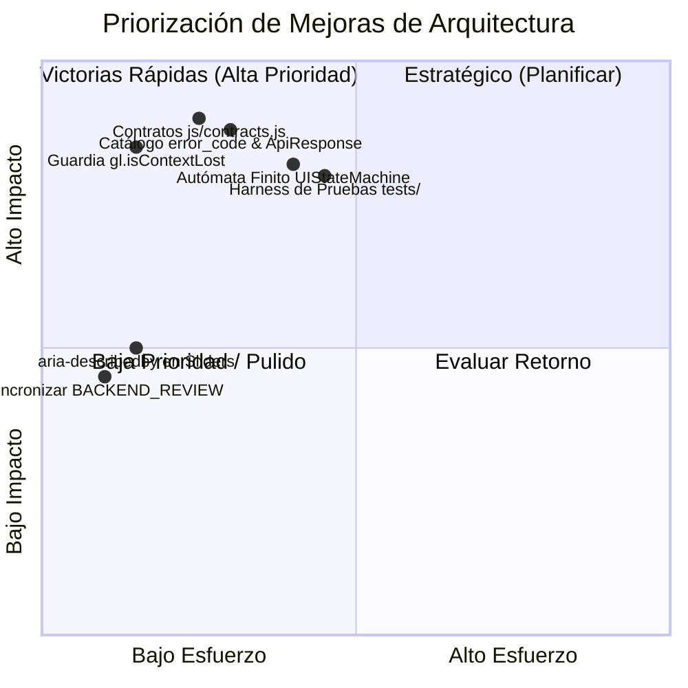

# AUDIT_REPORT.md — Informe Integral de Auditoría de Arquitectura (5 Vectores)

**Proyecto:** Aetheria Fluid & Generative Studio  
**Versión Auditada:** `1.6.1`  
**Motor de Auditoría:** Motor Autónomo de Auditoría y Evolución de Software Existente v3.1  
**Fecha:** 2026-09-01  
**Evaluación Global de Salud:** 88 / 100 (Excelente base técnica, alto rendimiento en GPU, cero dependencias; brechas centradas en contratos formales de datos, catálogo de errores estandarizado, autómata finito de UI y suite de pruebas automatizadas).

---

## 1. Clasificación de Hallazgos por Vector de Arquitectura

### 🧭 Vector 1: Dominio, Invariantes & Marco Legal

| ID | Vector | Hallazgo | Criticidad | Evidencia | Acción Sugerida |
| :--- | :--- | :--- | :--- | :--- | :--- |
| **V1-01** | Dominio | Sincronización implícita de estado de simetría con auto-regulación de boids | **Menor** | [js/state.js](file:///home/myinnervoid/Estudio%20Memexicanisimos/Fluidos/js/state.js#L81-L88): `setSymmetry()` muta directamente `this.swarmCount` y llama a `AetheriaSwarm.setBoidsCount()` si existe en el scope global. | Formalizar la regla de negocio mediante un despachador de eventos de estado desacoplado o callback pub/sub en `AetheriaState`. |
| **V1-02** | Legal & Privacidad | Verificación de cumplimiento de licencias y cero recolección de datos | **Aprobado** | [LICENSE](file:///home/myinnervoid/Estudio%20Memexicanisimos/Fluidos/LICENSE), [LEGAL_PRIVACY.md](file:///home/myinnervoid/Estudio%20Memexicanisimos/Fluidos/LEGAL_PRIVACY.md): Licencia MIT de Pavel Dobryakov intacta, 0 cookies, 0 telemetría externa. | Mantener las cabeceras de licencia en todos los archivos derivados y distribuciones. |
| **V1-03** | Dominio | Invariantes físicas de Navier-Stokes y acotamiento de energía GPU | **Aprobado** | [js/original/fluidCore.js](file:///home/myinnervoid/Estudio%20Memexicanisimos/Fluidos/js/original/fluidCore.js#L208-L250): Clamping $[-2500.0, 2500.0]$ en velocidades y $[0.0, 3.0]$ en densidades para prevenir NaNs en FBOs half-float. | Mantener clamping y documentar las constantes matemáticas en contratos formales. |

---

### 📜 Vector 2: Contratos de Datos, Esquema & Catálogo de Fallos

| ID | Vector | Hallazgo | Criticidad | Evidencia | Acción Sugerida |
| :--- | :--- | :--- | :--- | :--- | :--- |
| **V2-01** | Contratos | Ausencia de definiciones formales de tipos / interfaces estructuradas (JSDoc / TypeScript declarations) | **Mayor** | Todos los módulos JS en `js/` y `js/extensions/` usan objetos dinámicos ad-hoc sin contratos formales `@typedef` o esquemas de validación de datos. | Generar `js/contracts.js` con tipos JSDoc formales para `AetheriaStateModel`, `FluidConfig`, `BoidState`, `AvatarDefinition`, `BackgroundDefinition` y esquemas de validación en tiempo de ejecución. |
| **V2-02** | Contratos & IPC | Ausencia de estandarización obligatoria de transporte `ApiResponse<T>` (Ley Global 5) | **Mayor** | Métodos como `exportPNG()`, `startRecording()`, `saveCustomAvatar()`, `setBackground()` devuelven `void`, `boolean` o arrojan `console.warn` sin envoltorio estandarizado. | Implementar el contrato estándar `ApiResponse<T> = { success, data, error_code, message }` para todas las operaciones de exportación, persistencia, grabación y transiciones. |
| **V2-03** | Catálogo de Fallos | Inexistencia de un catálogo centralizado de códigos de error (`error_code`) | **Mayor** | [js/main.js](file:///home/myinnervoid/Estudio%20Memexicanisimos/Fluidos/js/main.js#L69-L74), [js/original/fluidCore.js](file:///home/myinnervoid/Estudio%20Memexicanisimos/Fluidos/js/original/fluidCore.js#L53): Los errores de inicialización, WebGL Context Loss y MediaRecorder se emiten mediante strings planos o `alert()`. | Crear `AetheriaErrorCatalog` con enumeración canónica de errores: `ERR_WEBGL_UNSUPPORTED`, `ERR_CONTEXT_LOST`, `ERR_RECORDER_UNSUPPORTED`, `ERR_INVALID_FILE_TYPE`, `ERR_STORAGE_QUOTA`, `ERR_SHADER_COMPILE_FAILED`. |

---

### 🛡️ Vector 3: Lógica de Dominio, Concurrencia & Hardening

| ID | Vector | Hallazgo | Criticidad | Evidencia | Acción Sugerida |
| :--- | :--- | :--- | :--- | :--- | :--- |
| **V3-01** | Hardening | Falta de verificación de `gl.isContextLost()` previo al ciclo `step()` y `render()` en el bucle principal | **Mayor** | [js/main.js](file:///home/myinnervoid/Estudio%20Memexicanisimos/Fluidos/js/main.js#L264-L277): Si el contexto WebGL se pierde durante el frame, el pipeline intenta ejecutar draw calls antes de que el evento `webglcontextlost` detenga el bucle. | Incorporar guardias `if (FluidCore.isContextLost()) return;` en cada paso del bucle y método `step(dt)` / `render()`. |
| **V3-02** | Concurrencia | Throttling y rate limiting de inyección de punteros y partículas | **Aprobado** | [js/extensions/symmetry.js](file:///home/myinnervoid/Estudio%20Memexicanisimos/Fluidos/js/extensions/symmetry.js#L77-L89): Cooldown de 35ms por ID de puntero y límite estricto de 16 splats/frame. | Preservar este mecanismo anti-saturación GPU. |
| **V3-03** | Hardening & AppSec | Política de Seguridad de Contenido (CSP) y sanitización de nombres de archivo | **Aprobado** | [index.html](file:///home/myinnervoid/Estudio%20Memexicanisimos/Fluidos/index.html#L8), [js/main.js](file:///home/myinnervoid/Estudio%20Memexicanisimos/Fluidos/js/main.js#L229-L230): CSP estricta client-side y nombres con timestamp seguro. | Mantener política CSP y validaciones de extensión de archivo en avatar custom. |

---

### 🖥️ Vector 4: Superficie de Interfaz, Ergonomía & Mapeo de Estados

| ID | Vector | Hallazgo | Criticidad | Evidencia | Acción Sugerida |
| :--- | :--- | :--- | :--- | :--- | :--- |
| **V4-01** | Autómata de UI | Falta de un Autómata Finito formal para la interfaz (Ley Global 6) | **Mayor** | [js/extensions/ui.js](file:///home/myinnervoid/Estudio%20Memexicanisimos/Fluidos/js/extensions/ui.js): Los estados visuales se gestionan mediante toggle de clases CSS dispersos sin transitar explícitamente por los 5 estados `[IDLE]`, `[PENDING]`, `[SUCCESS]`, `[EMPTY]`, `[FAULT]`. | Implementar un gestor de estados `UIStateMachine` que orqueste la carga de fondos, exportación de PNG, grabación de video y carga de avatar mediante el autómata canónico de 5 estados. |
| **V4-02** | Accesibilidad & ARIA | Asociación de tooltips de sliders con `aria-describedby` para lectores de pantalla | **Menor** | [index.html](file:///home/myinnervoid/Estudio%20Memexicanisimos/Fluidos/index.html#L271-L322): Los sliders tienen tooltips visuales con `data-tooltip`, pero no todos enlazan sus `id` de tooltip con `aria-describedby` en el `<input type="range">`. | Añadir `id` únicos a los `` y vincularlos vía `aria-describedby` al input correspondiente. |
| **V4-03** | Ergonomía Móvil | Layout responsive en 3 zonas, docking Arriba/Abajo y Modo Zen | **Aprobado** | [index.html](file:///home/myinnervoid/Estudio%20Memexicanisimos/Fluidos/index.html#L24-L80), [css/style.css](file:///home/myinnervoid/Estudio%20Memexicanisimos/Fluidos/css/style.css): Acceso inamovible a Ajustes en móvil, scroll táctil suave y Modo Zen instantáneo con `[H]`. | Mantener la disposición ergonómica en 3 zonas. |

---

### ⚙️ Vector 5: Infraestructura, Resiliencia & Auditoría Cruzada

| ID | Vector | Hallazgo | Criticidad | Evidencia | Acción Sugerida |
| :--- | :--- | :--- | :--- | :--- | :--- |
| **V5-01** | Resiliencia & QA | Ausencia de suite de pruebas automatizadas en el navegador (Unit / Integration / Shader Integrity Tests) | **Mayor** | El repositorio contiene documentación exhaustiva de QA (`QA_REVIEW.md`), pero no incluye un ejecutable de pruebas unitarias o de integración automatizado para verificar regresiones de física, shaders o estado. | Crear una suite ligera de pruebas en el navegador (`tests/test_runner.html` y `tests/aetheria_spec.js`) que valide automáticamente contratos de estado, compilación de shaders, cálculo de rotación de avatares y respuestas de error. |
| **V5-02** | Auditoría Cruzada | Inconsistencias históricas en reportes de revisión previos (`BACKEND_REVIEW.md` vs código actual) | **Menor** | [BACKEND_REVIEW.md](file:///home/myinnervoid/Estudio%20Memexicanisimos/Fluidos/BACKEND_REVIEW.md#L19-L53): Reporta falta de método `dispose()`, pero [js/original/fluidCore.js](file:///home/myinnervoid/Estudio%20Memexicanisimos/Fluidos/js/original/fluidCore.js#L804-L838) ya lo implementa completamente. | Actualizar `BACKEND_REVIEW.md` y `FRONTEND_REVIEW.md` para reflejar el estado real implementado. |
| **V5-03** | Infraestructura | Estrategia PWA Offline Cache-First y Compatibilidad `file://` | **Aprobado** | [manifest.json](file:///home/myinnervoid/Estudio%20Memexicanisimos/Fluidos/manifest.json), [sw.js](file:///home/myinnervoid/Estudio%20Memexicanisimos/Fluidos/sw.js): PWA completa, sin dependencias externas CDN, 100% offline. | Mantener estrategia de cacheo local. |

---

## 2. Matriz de Brechas de Artefactos

| Artefacto Requerido | Estado Actual | Vector Asociado | Acción Requerida |
| :--- | :--- | :--- | :--- |
| `AUDIT_REPORT.md` | Generado v3.1 | Global | Publicado y versionado en la raíz del proyecto. |
| `DECISIONS.md` | Incompleto / Faltante | Global | Generar registro formal de decisiones arquitectónicas y justificaciones. |
| `Matriz de Trade-offs` | Faltante | Global | Incorporar matriz comparativa técnica en `DECISIONS.md`. |
| `js/contracts.js` | Faltante | Vector 2 | Crear módulo de contratos con tipos JSDoc, esquemas y catálogo `AetheriaErrorCatalog`. |
| `ApiResponse<T>` Wrapper | Faltante | Vector 2 & 5 | Implementar estándar `ApiResponse<T>` para operaciones asíncronas y exportaciones. |
| `UIStateMachine` | Faltante | Vector 4 | Crear máquina de estados canónica (`IDLE`, `PENDING`, `SUCCESS`, `EMPTY`, `FAULT`). |
| `tests/test_runner.html` | Faltante | Vector 5 | Crear harness interactivo de pruebas unitarias y de integración autónomo. |
| `BACKEND_REVIEW.md` | Desactualizado | Vector 1 & 5 | Sincronizar hallazgos con código existente (`dispose` implementado). |

---

## 3. Lista Priorizada de Mejoras (Impacto vs Esfuerzo)

### Orden de Ejecución Recomendado:
1. **Fase 2.1 — Contratos de Datos & Catálogo de Errores (Vector 2):**
   - Crear `js/contracts.js` con el catálogo formal de errores (`AetheriaErrorCatalog`), esquema de validación y la función constructora estándar `createApiResponse(success, data, errorCode, message)`.
2. **Fase 2.2 — Hardening de Contexto WebGL & Resiliencia (Vector 3):**
   - Integrar guardias `isContextLost()` en `FluidCore` y `main.js` para evitar llamadas a GL sobre contexto destruido.
3. **Fase 2.3 — Autómata Finito de Interfaz `UIStateMachine` (Vector 4):**
   - Implementar el despachador de estados de UI con los 5 estados canónicos (`IDLE`, `PENDING`, `SUCCESS`, `EMPTY`, `FAULT`) para fondos, avatares, grabaciones y exportaciones.
4. **Fase 2.4 — Accesibilidad Refinada (Vector 4):**
   - Vincular los tooltips con `aria-describedby` a los sliders de parámetros físicos.
5. **Fase 2.5 — Suite de Pruebas Automatizadas en Navegador (Vector 5):**
   - Crear `tests/test_runner.html` y `tests/aetheria_spec.js` para validación automatizada de contratos, física y shaders sin dependencias de Node.js o CLI externo.
6. **Fase 2.6 — Sincronización de Documentación Histórica (Vector 1 & 5):**
   - Actualizar `BACKEND_REVIEW.md` y `FRONTEND_REVIEW.md`.
