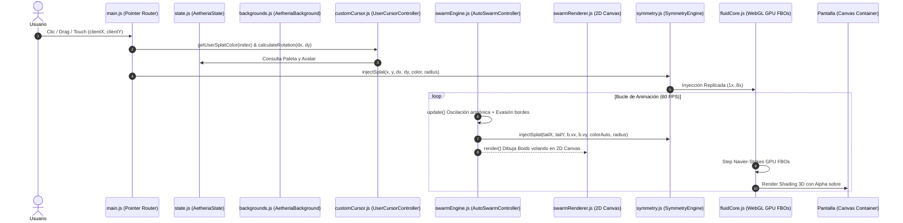

# PROJECT_SPEC.md — Especificación de Producto y Arquitectura

**Proyecto:** Aetheria Fluid & Generative Studio  
**Versión Actual:** `1.6.0-backgrounds-swarm`  
**Base Tecnológica:** WebGL 1/2, HTML5 Canvas 2D, Vanilla JavaScript (IIFE / Namespace Global), CSS3 Glassmorphism.  
**Referencia Matemática:** GPU Gems Capítulo 38 (*Fast Fluid Dynamics Simulation on the GPU* - Mark J. Harris / Jos Stam).  
**Demo en Línea:** [https://myinnervoid.github.io/Memexicanisimos-Aetheria-Fluid---Sand-Studio/](https://myinnervoid.github.io/Memexicanisimos-Aetheria-Fluid---Sand-Studio/)

---

## 1. Visión y Alcance del Producto

Aetheria es un estudio interactivo de arte generativo y física de fluidos en GPU en tiempo real. Funciona tanto en navegadores modernos como de forma 100% autónoma en local (protocolo `file://`).

### Modos y Elementos Activos
1. **💧 Fluido 3D:** Dinámica de fluidos Navier-Stokes 2D con proyección de presión por diferencias finitas (Helmholtz-Hodge), confinamiento de vorticidad (Fedkiw) y renderizado con sombreado 3D difuso/especular, Bloom HDR y dithering óptico.
2. **⏳ Arena Granular (Reloj de Arena):** Shader post-procesado que cuantiza el campo de densidad en miles de granos individuales con textura mineral y relieve que caen con la gravedad.
3. **🔴 Lava Lamp:** Perfil de física con alta flotabilidad térmica, convección ascendente y gotas viscosas orgánicas.
4. **💨 Gas / Humo:** Perfil volumétrico de baja disipación de masa y alta vorticidad ($\text{CURL} = 42.0$).
5. **🖼️ 8 Fondos Inmersivos:** Galería adaptativa en 16:9 y 9:16 con mezcla de transparencia en WebGL.
6. **🐱 6 Punteros Temáticos:** Nyan Cat, Cohete Espacial ($360^\circ$), Cometa Cósmico, Pez Payaso Nemo, Hatsune Miku y Avatar Personalizado.
7. **🐟 Modo Pecera Swarm Boids:** Agentes autónomos con física Craig Reynolds y evasión suave de bordes al 8%.

---

## 2. Flujo de Datos y Pipeline de Ejecución



---

## 3. Estructura de Directorios

```
/
├── assets/
│   ├── backgrounds/                # 8 Fondos duales (16:9 y 9:16)
│   ├── palettes.js                 # Definición de paletas temáticas
│   ├── screenshot1.png             # Captura de pantalla real del estudio
│   └── LDR_LLL1_0.png             # Textura de dithering para WebGL
├── css/
│   └── style.css                   # Glassmorphism, fondos, UI responsive
├── js/
│   ├── state.js                    # Bus de Estado Centralizado (AetheriaState)
│   ├── main.js                     # Orquestador del bucle principal y eventos
│   ├── original/
│   │   └── fluidCore.js            # Solver Navier-Stokes GPU WebGL (Alpha Blending)
│   └── extensions/
│       ├── backgrounds.js          # Gestor de fondos inmersivos adaptativos (16:9 / 9:16)
│       ├── customCursor.js         # Controlador de los 6 punteros temáticos
│       ├── swarmEngine.js          # Modo Pecera Boids autónomo
│       ├── swarmRenderer.js        # Renderizado visual 2D de Boids en pantalla
│       ├── symmetry.js             # Motor de inyección unificada con simetría
│       ├── sandMode.js             # Shader post-process de arena granular
│       ├── particleFx.js           # Emisión de partículas (burbujas, fuego, píxeles)
│       ├── fidgets.js              # Supernova, Vórtice, Gravedad
│       └── ui.js                   # Controlador del drawer, sliders y botones
├── index.html                      # Punto de entrada Web / Standalone PWA
├── manifest.json                   # Manifiesto PWA Offline
└── sw.js                           # Service Worker con estrategia Cache-First
```
