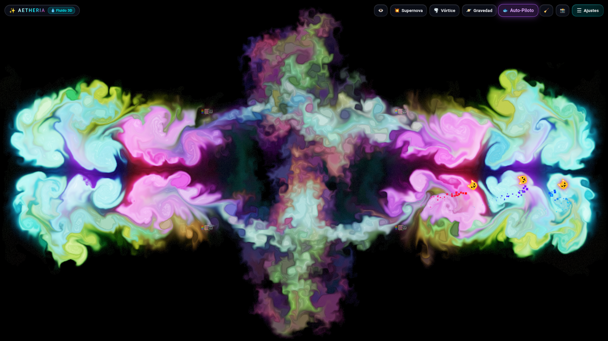

# AETHERIA | Generative Fluid & Sand Studio

[](https://myinnervoid.github.io/Memexicanisimos-Aetheria-Fluid---Sand-Studio/)
[](LICENSE)
[](https://www.khronos.org/webgl/)
[](manifest.json)
[](README.md)



> 🌐 **Experience the live interactive studio directly in your browser:**  
> 👉 **[https://myinnervoid.github.io/Memexicanisimos-Aetheria-Fluid---Sand-Studio/](https://myinnervoid.github.io/Memexicanisimos-Aetheria-Fluid---Sand-Studio/)**

**Aetheria** is an interactive generative art and real-time fluid dynamics studio powered by GPU WebGL Navier-Stokes numerical solvers. It unifies incompressible liquid flow, granular sand particle shaders (*hourglass mode*), high-vorticity cosmic gas, unified multicursor radial symmetries (1x to 8x), an autonomous 6-avatar aquarium swarm, an adaptive gallery of **8 immersive backgrounds** in dual aspect ratios (16:9 for desktop and 9:16 for portrait mobile), and a **mobile-responsive 3-zone touch interface with Fullscreen and dockable top/bottom positioning**.

---

## 🌟 Highlights and Evolution (Version 1.6.0)

Since version 1.0.0, Aetheria has expanded into a full generative environment:

* 📱 **3-Zone Touch Interface & Native Fullscreen:**
  - **Always-Accessible Settings Button:** The settings menu (`☰ Settings`), **Fullscreen toggle (`⛶`)**, and **Zen Mode (`👁️`)** are permanently anchored in the top-right corner, ensuring 1-tap access on any mobile phone without needing "Desktop Mode".
  - **Center Touch Scroll Area:** Secondary fidgets (*Supernova, Vortex, Gravity, Auto-Pilot, Clear*) glide horizontally with fluid touch momentum (`touch-action: pan-x`).
  - **Dockable Bar (Top / Bottom):** The `↕️` button toggles the toolbar between the top and bottom edge for comfortable single-handed mobile reach.
  - **Fullscreen API (`[F]` or `⛶`):** Cross-browser Fullscreen API hides browser address bars on Android/iOS for an unobstructed canvas.

* 🖼️ **8 Adaptive Immersive Backgrounds (16:9 Desktop / 9:16 Mobile):**
  - Real-time orientation detector automatically loads the optimized resolution:
    1. `🌑 Void (Pure Black)`: High-contrast minimalist backdrop.
    2. `🌌 Deep Universe`: Cosmic starfield with cyan and violet nebulae.
    3. `🌀 Spiral Galaxy`: Luminous galactic core with swirling starlight arms.
    4. `🏊 Crystal Clear Pool`: Turquoise swimming pool with underwater solar caustics.
    5. `🪣 Water Bucket`: Pure water surface with metallic highlights and droplets.
    6. `🏝️ Caribbean Sea`: Turquoise shallow waters with white coral sand dunes.
    7. `🏞️ Mountain River`: Freshwater river stream flowing over river stones.
    8. `🌿 Mystical Lagoon`: Bioluminescent jungle lagoon reflections.
    9. `🕳️ Sacred Cenote`: Yucatan limestone cenote with dramatic piercing sunlight beam.
  - **WebGL Alpha Blending:** The fluid overlays cleanly on top of backgrounds for a cohesive ambient screen.

* 🐱 **6 Decoupled Thematic Cursors:**
  1. `🚫 None`: Clean, minimal fluid stroke using active palette solid colors.
  2. `🐱 Nyan Cat`: Solid palette color on user clicks & continuous 6-band chromatic rainbow in autonomous mode.
  3. `🚀 Space Rocket`: $360^\circ$ dynamic orientation along movement vector with rear reactive combustion thruster.
  4. `☄️ Cosmic Comet`: Forward core with icy plasma tail and silver stardust.
  5. `🐠 Clownfish (Nemo)`: Organic swimming oscillation with bioluminescent bubble trail.
  6. `🩵 Hatsune Miku`: Techno pop trail (#39C5BB Neon Teal and Electric Magenta) with glowing flares.
  7. `📁 Custom Avatar`: Upload any local PNG/GIF file directly from your device.

* 🐟 **Autonomous "Aquarium" Mode (Swarm Boids):** Flocking agents with **quadratic soft boundary repulsion** (8% margin) ensuring agents swim fluidly without ever leaving the viewport, with organic harmonic oscillations.
* 🎨 **Real-Time Visual Boid Renderer (`SwarmRenderer`):** Dedicated overlay 2D canvas painting avatars with dynamic angle rotation, glowing shadows, and custom image support.
* 🪞 **Unified Radial Symmetry (1x to 8x):** Boids and user strokes pass through the master `SymmetryEngine.injectSplat`, producing synchronized moving mandalas while auto-throttling boids to preserve 60 FPS.
* 🏛️ **Centralized State Bus (`AetheriaState`):** Decoupled architecture with LocalStorage persistence (`aetheria_bar_position`, `aetheria_dev_mode`, etc.).

---

## 🌊 Physical Parameters Guide

| Parameter | Range | Visual Effect & Description |
|---|:---:|---|
| **🌪️ Vorticity** | 0 – 60 | Intensity of rotational vortices. Higher values twist fluid into chaotic, vibrant curls. |
| **💨 Density Dissipation** | 0.1 – 2.0 | Fade speed of color density. Low values (0.1) preserve color for minutes; high values (2.0) dissipate instantly into light smoke. |
| **🎯 Splat Radius** | 0.05 – 1.0 | Size of fluid bursts injected by cursor or boids. |
| **⏳ Grain Size** | 4px – 32px | Grain scale in Sand Mode (coarse pebble grains vs crisp mineral texture). |
| **🪐 Gravity Force** | 0.5 – 5.0 | Continuous downward vertical acceleration creating liquid cascades. |
| **🐟 Boid Count** | 1 – 10 (50 dev) | Number of autonomous boid avatars swimming in the aquarium. |

---

## ⌨️ Keyboard Shortcuts

| Key | Action |
| :--- | :--- |
| **`[1]`** | 3D Fluid Mode |
| **`[2]`** | Lava Lamp Mode (Viscous thermal convection) |
| **`[3]`** | Granular Sand Mode (Hourglass) |
| **`[4]`** | Gas / Cosmic Smoke Mode |
| **`[F]`** | **Fullscreen** (Toggle Fullscreen Mode) |
| **`[H]`** | **Zen Mode** (Toggle entire UI visibility) |
| **`[A]`** | Toggle Swarm Auto-Pilot (Aquarium) |
| **`[M]`** | Open / Close Settings Drawer |
| **`[Escape]`** | Close Settings Drawer |
| **`[S]`** | Trigger Supernova Shockwave |
| **`[V]`** | Inject Rotational Vortex |
| **`[G]`** | Toggle Cascade Gravity (ON / OFF) |
| **`[C]`** | Cycle Active Color Palette |
| **`[Space]`** | Pause / Resume Physics Simulation |
| **`[Del]` / `[Backspace]`** | Clear Canvas |

---

## 🚀 Getting Started

### Option 1: Live Web Demo (GitHub Pages)
Visit [https://myinnervoid.github.io/Memexicanisimos-Aetheria-Fluid---Sand-Studio/](https://myinnervoid.github.io/Memexicanisimos-Aetheria-Fluid---Sand-Studio/).

### Option 2: 100% Offline (Double-Click)
Double-click `index.html` in your file manager. Works instantly without internet or dependencies.

### Option 3: Local Development Server
```bash
# Using Python
python3 -m http.server 8080

# Using Node.js
npx serve .
```

---

## 📄 License

Released under the **MIT License**. See [LICENSE](LICENSE) for details.

Copyright (c) 2017 Pavel Dobryakov  
Modular architecture, extended physics, adaptive backgrounds, avatars, swarm & responsive touch UI by Estudio Memexicanisimos.
